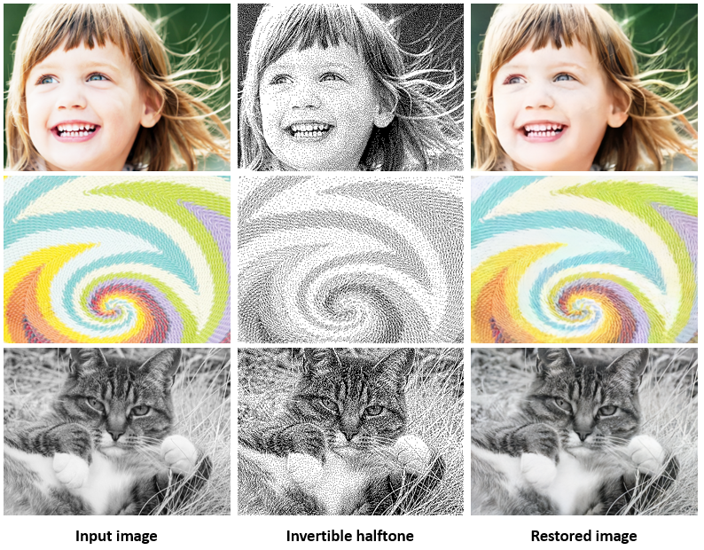

# Deep Halftoning with Reversible Binary Pattern
### [ICCV Paper](cvf_xxx.html) | [Project Website](tt_xxx.html) | [BibTex](#citation) 

<!-- ------------------------------------------------------------------------------ -->
## Overview
Existing halftoning algorithms usually drop colors and fine details when dithering color images with binary dot patterns, which makes it extremely difficult to recover the original information. To dispense the recovery trouble in future, we propose a novel halftoning technique that dithers a color image into binary halftone with decent restorability to the original input. The key idea is to implicitly embed those previously dropped information into the binary dot patterns. So, the halftone pattern not only serves to reproduce the image tone, maintain the blue-noise randomness, but also represents the color information and fine details. See the examples illustrated below.

<div align="center">
	
</div>


<!-- -------------------------------------------------------- -->
## Run 
1. Requirements:
    * Install python3.7
    * Install [pytorch](https://pytorch.org/) (tested on Release 1.0.1)
    * Install python requirements:
    ```bash
       pip install -r requirement.yaml
    ```

2. Training:
    * Place your training set/validation set under `dataset/` per the exampled file organization. Download our preprocessed full dataset [Here](coming soon).
    * Warm-up stage (optional): Run 
	```bash
	python train_warm.py --config scripts/invhalf_warm.json
	```
	If this stage skipped, please download the pretrained warm-up weight [here](https://drive.google.com/file/d/1GMRkqeNJtygoZsPy2toibuoZpcWhep6h/view?usp=sharing), and place it in `checkpoints/` that will be loaded at joint-train stage.
    * Joint-train stage: Run 
	```bash
	python train.py --config scripts/invhalf_full.json
	```

3. Testing:
	* Download the [pretrained weight](https://drive.google.com/file/d/1kw-FoS8lF_tgdiCkGG51UaUtmCcFvKiD/view?usp=sharing) below and put it under `checkpoints/`.
    * Place your images in any accesible directory, e.g. `test_imgs/`.
    * Run
	```bash
	python inference_fast.py --model checkpoints/model_best.pth.tar --data_dir ./test_imgs --save_dir ./result
	```


## Copyright and License
You are granted with the [LICENSE](./LICENSE) for both academic and commercial usages.

<!-- ------------------------------------------------------------------- -->
## Citation
If any part of our paper and code is helpful to your work, please generously cite with:
```
@inproceedings{xia-2021-inverthalf,
	author   = {Menghan Xia and Wenbo Hu and Xueting Liu and Tien-Tsin Wong},
	title    = {Deep Halftoning with Reversible Binary Pattern},
	booktitle = {{IEEE/CVF} International Conference on Computer Vision (ICCV)},
	year = {2021}
}
```
